# TestForge Application Flow Documentation

This document provides a detailed walkthrough of the various application flows within the TestForge ecosystem using granular step-by-step paths.

---

## 🏗️ System Architecture Overview

TestForge operates as a **Windowed OS Abstraction** inside the browser. 
- **OS Shell**: Dock -> App Launcher -> Window Management.
- **Global Settings**: Menu Bar -> Theme Toggle | Font Scale | Dock Autohide.

---

## 👨‍🏫 Admin Application Flows (Teacher Role)

### 1. Test Orchestration (Test Manager)
`Test Manager App` ➔ `List of All Tests` ➔ `Create New Test (Modal)` ➔ `Enter Metadata` ➔ `Save`
`Test Manager App` ➔ `Select Test` ➔ `Control Panel` ➔ `▶ Start / ■ End Test (Manual Overrides)`
`Test Manager App` ➔ `Select Test` ➔ `View Live Leaderboard` ➔ `Ranked Student Results`

### 2. Question Engineering (Question Bank)
`Question Bank App` ➔ `Select Test` ➔ `Test Question List` ➔ `+ Add New Question` ➔ `Choose Type (MCQ/Debug)` ➔ `Editor Form` ➔ `Save`
`Question Bank App` ➔ `Select Test` ➔ `Bulk Import` ➔ `Upload CSV/JSON` ➔ `Validation Results` ➔ `Attach to Test`

### 3. AI Variant Workflow (Debugging Questions)
`Question Bank App` ➔ `Open Debug Question` ➔ `Enter Correct Code` ➔ `✨ Generate Variants` ➔ `AI Processing (Gemma)` ➔ `Variant Review Panel` ➔ `Side-by-Side Diff View` ➔ `Approve Variants` ➔ `Pool Finalized`

### 4. Integrity & Behavioral Audit (Integrity App)
`Integrity App` ➔ `List of All Tests` ➔ `Select Test` ➔ `Student Attempt List (Sorted by Risk)` ➔ `Select Student` ➔ `Integrity Report` ➔ `Behavioral Timeline` ➔ `Confirm/Dismiss Flags`

### 5. Environment Configuration (Test Settings)
`Test Settings App` ➔ `Select Test` ➔ `Policy Dashboard` ➔ `Toggle Security Rules (Paste/Tab Switch)` ➔ `Set Question Unlock Times` ➔ `Save Config`

---

## 🎓 Student Application Flows (Student Role)

### 1. The Academic Hub (Tests App)
`Tests App` ➔ `Year/Division Filtered View` ➔ `List of Available Tests` ➔ `Check Status (Open/In-progress/Concluded)` ➔ `Click Test Card` ➔ `Proctored Start Screen`

### 2. The Secure Session (Test Session App)
`Start Screen` ➔ `Acknowledge Rules` ➔ `Initialize Session` ➔ `Window Locked` ➔ `Question Navigator` ➔ `Attempt MCQ / Debug` ➔ `Real-time Integrity Score Monitor` ➔ `Submit (Auto/Manual)`

### 3. Debugging IDE Flow (Coding Overlay)
`Test Session` ➔ `Select Debug Question` ➔ `Launch Full-Screen Editor` ➔ `Side-by-Side Reference` ➔ `Monaco Editor` ➔ `▶ Run (Visible Cases)` ➔ `Terminal Output` ➔ `Save & Close`

### 4. Post-Test Feedback (Results App)
`Results App` ➔ `List of Attempted Tests` ➔ `Select Test` ➔ `Score Overview` ➔ `Question-by-Question Breakdown` ➔ `Hidden vs Visible Test Case Report` ➔ `View Final Rank`

### 5. Personal Analytics (Analytics App)
`Analytics App` ➔ `Personal Performance Dashboard` ➔ `Subject-wise Breakdown` ➔ `Score Trends (Line Chart)` ➔ `Time Management Metrics`

---

## 🛡️ System-Level Flows (Automated)

### 1. Real-time Integrity Enforcement
`Browser Event (Focus Lost)` ➔ `OS Shell Listener` ➔ `Decrement Integrity Score` ➔ `Toast Warning` ➔ `Push Flag to DB` ➔ `[Optional] Auto-Submit if Limit Reached`

### 2. Evaluation Pipeline
`Submission Event` ➔ `Server: Evaluator.js` ➔ `MCQ Grading (SQL Compare)` ➔ `Debugging Grading (Judge0 Execution)` ➔ `Hidden Test Case Validation` ➔ `Postgres Trigger: Score Calculation` ➔ `Result finalized`

---

## 🔗 High-Level Lifecycle Map

```mermaid
graph LR
    A[Admin Manager] -- Create --> B[Admin Bank]
    B -- AI Variants --> C[Test Ready]
    C -- Schedule --> D[Student Hub]
    D -- Start --> E[Secure Session]
    E -- Event tracking --> F[Integrity Engine]
    F -- Submission --> G[Automatic Grading]
    G -- Data Sync --> H[Admin Integrity Audit]
    H -- Final Score --> I[Student Results]
```

