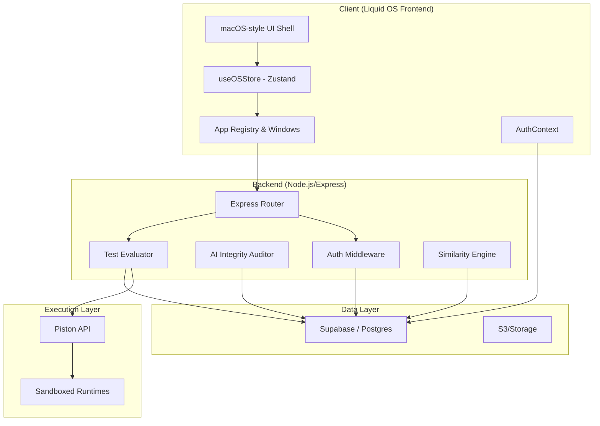
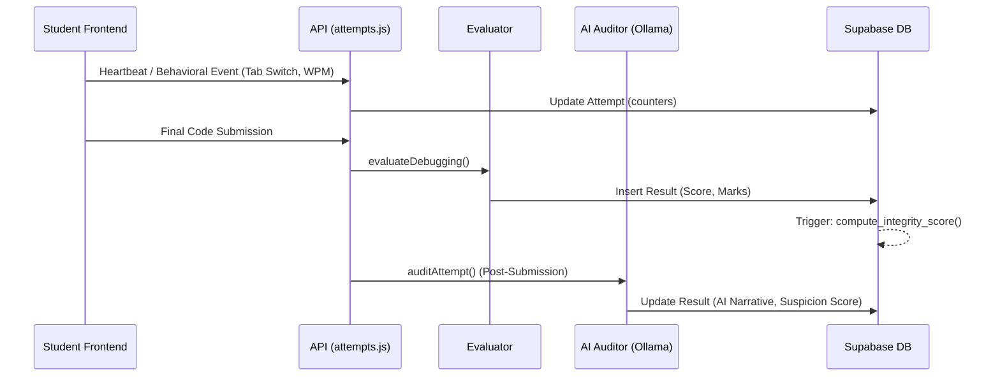
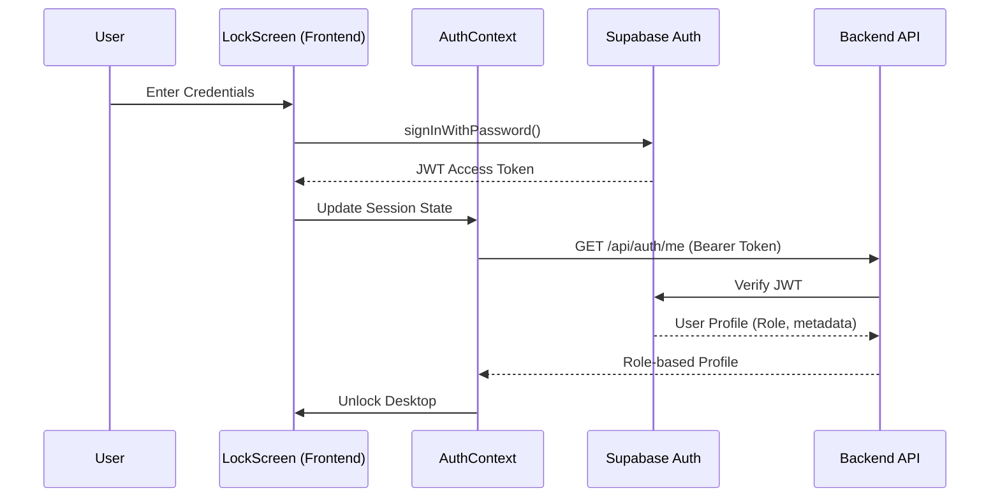

# Technical Diagrams - Liquid OS (v1)

This document contains the source code for the technical visualizations of Liquid OS. To view these diagrams, use a GitHub-compatible markdown viewer or a Mermaid live editor.

## 1. High-Level System Architecture
This diagram illustrates the multi-layered communication between the Liquid OS frontend, the Node.js API, and the sandboxed execution environment.

## 2. Integrity Scoring Pipeline
The flow of integrity data from telemetry collection to forensic AI analysis.

## 3. Authentication & Authorization Flow
How Liquid OS secures sessions across the frontend and backend.

